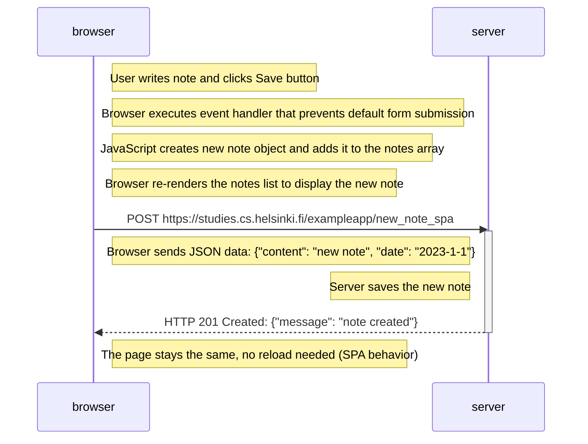

```mermaid
sequenceDiagram
    participant browser
    participant server

    Note right of browser: User writes note and clicks Save button
    Note right of browser: Browser executes event handler that prevents default form submission
    Note right of browser: JavaScript creates new note object and adds it to the notes array
    Note right of browser: Browser re-renders the notes list to display the new note

    browser->>server: POST https://studies.cs.helsinki.fi/exampleapp/new_note_spa
    activate server
    Note right of browser: Browser sends JSON data: {"content": "new note", "date": "2023-1-1"}
    Note left of server: Server saves the new note
    server-->>browser: HTTP 201 Created: {"message": "note created"}
    deactivate server

    Note right of browser: The page stays the same, no reload needed (SPA behavior)

```